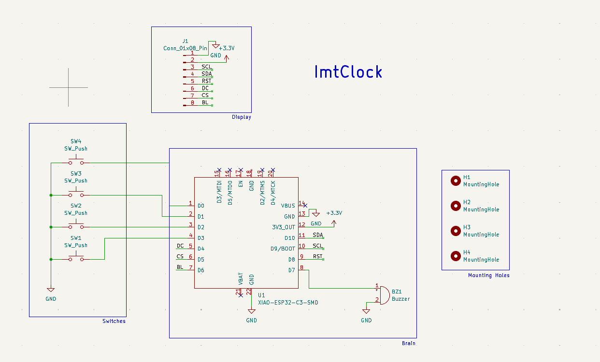
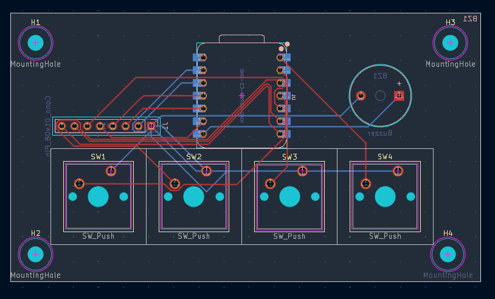

# ImtClock

ImtClock is a project made for <a href="stardance.hackclub.com"><b>Stardance</b></a> from <a href="hackclub.com"><b>Hack Club</b></a>. ImtClock is made as a reference product of <a href="https://blare.hackclub.com/"><b>Blare</b></a>, it's a project shared by <a href="hackclub.com"><b>Hack Club</b></a>.

## Schematics

## Footprints

## PCB

## 3D PCB
