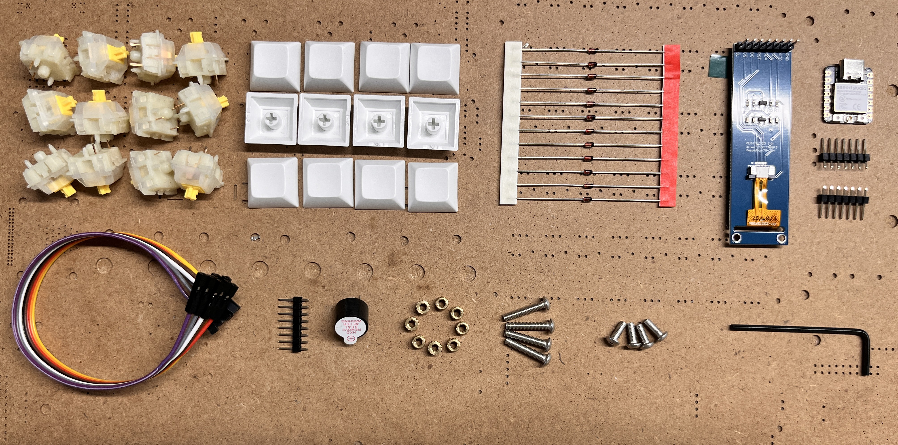

# ImtClock

ImtClock is a project made for <a href="stardance.hackclub.com"><b>Stardance</b></a> from <a href="hackclub.com"><b>Hack Club</b></a>. ImtClock is made as a reference product of <a href="https://blare.hackclub.com/"><b>Blare</b></a>, it's a project shared by <a href="hackclub.com"><b>Hack Club</b></a>.

## Schematics

## Footprints

## PCB

## 3D PCB

## 3D Printed Parts

## Result

## Ingredients needed to make this
- <a href="https://wiki.seeedstudio.com/XIAO_ESP32C3_Getting_Started/"><b>Seeed Studio XIAO ESP32-C3</b></a>
- 4x <a href="https://cdn.shopify.com/s/files/1/0565/8070/2297/files/SPEC-KS-3Y10B050NW-X1-Yellow_Switch.pdf?v=1675841028"><b>MX Style Keyboard Switches</b></a>
- 4x White Blank DSA Keycaps
- 1x 2.25in TFT Screen
- 1x 3.3V Piezo Buzzer

Hack Club will provide their <a href="https://blare.hackclub.com/docs/rewards"><b>Blare Kit</a></b> for this project. Here are the things they'll provide.

## Thanks to Hack Club.
Made by <a href="github.com/imtua"><b>Imtu</b></a> with the help of <a href="hackclub.com"><b>Hack Club</b></a>.
Hack Club Stardance: stardance.hackclub.com
Register now through my link: <a href="https://stardance.space/r-aq7c7"><b>Register now!</b></a>
ImtClock Project on Stardance: <a href="https://stardance.hackclub.com/projects/56342"><b>ImtClock</b></a>